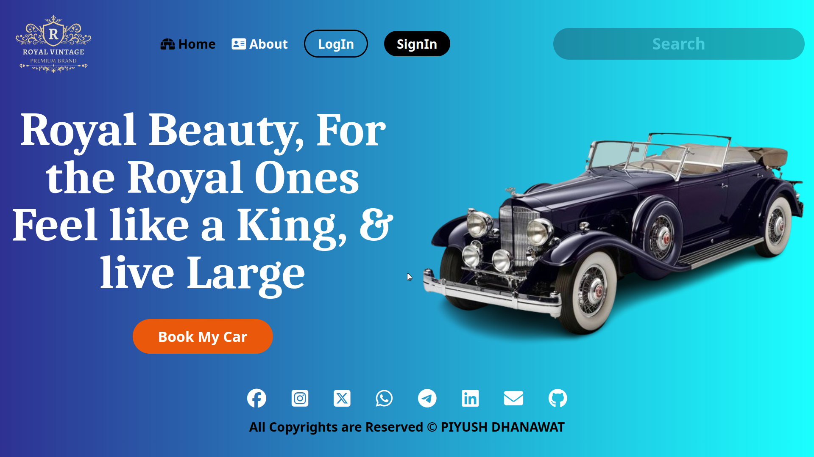

# Royal Vintage Landing Page

## Description

Royal Vintage Landing Page is a project developed using Figma for design and Tailwind CSS Framework for styling. It serves as a landing page template for selling a royal vintage car.

## Features

- **Responsive Design:** Ensures compatibility across various devices.
- **Elegant Styling:** Utilizes Tailwind CSS for a modern and visually appealing look.
- **Sections Included:** Homepage, About Us, Car Models, Contact Form.

## Preview



## Technologies Used

- Figma
- Tailwind CSS

## Usage

1. **Clone the repository:**

   ```
   git clone https://github.com/piyush26102/royal-vintage-landing-page.git
   ```

2. **Navigate to the project directory:**

   ```
   cd royal-vintage-landing-page
   ```

3. **Open the HTML file in your browser:**

   ```
   Open index.html
   ```

## Contributing

Pull requests are welcome. For major changes, please open an issue first to discuss what you would like to change.
